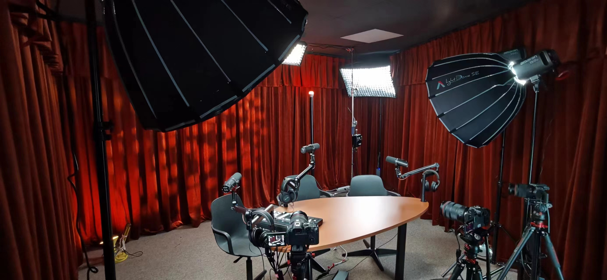

---
tags:
  - Podcast
  - EZ-Fashion
podcast: EZ Fashion
episode: "65"
title: '[Schiaparelli 神仙打架的高定秀，她在香奈儿隔壁搞超现实主义](https://www.xiaoyuzhoufm.com/episode/69a7957da22480add6e29fbe)'
Release Date: 2026-03-05
---

> 本期播客聚焦2026春夏高定周的Schiaparelli大秀。现任设计师以《创世纪》为灵感，将蝎子、鸟类等自然异象融入设计，展现了耗时数千小时的极致手工工艺与震撼的视觉张力。节目同步回顾了创始人Elsa叛逆的传奇人生，以及她与达利等艺术家的超现实主义共谋。在资本的加持下，该品牌以不妥协的狂野姿态强势重返大众视野，用极致的艺术表达有力回应了当下时尚界打破极简平庸、渴望“视觉惊奇”的迫切时代需求。

## Shownotes

【主理人来信📨】（本期节目简介、概述）

Hi大家好！

这期是节前2026春夏高定秀期间录制的，但播出时已经在走2026秋冬成衣时装周了。

本期，我们再次讲一个之前没有讲过的品牌——近几年重回大众视野的Schiaparelli 。

**关于2026年春夏**

我相信很多人重新注意到它，这套LOOK功不可没

本季Schiaparelli 野性延伸到了一个新的领域。23年的狮子 豹子，现在是鱼类/鸟类/蝎子。本季灵感来自西斯廷教堂的壁画，米开朗琪罗的创世纪。我竟然在看配饰的时候，觉得那些鞋子上的羽毛，鸟头，让我想到了点翠。

让人欣喜的无防水台的10cm高跟鞋，世界需要这样的美！还有蝎子的LOOK，蝎尾的钩子，我以为是3D打印没想到是焊接出骨架。

设计师着重讲了这套“河豚”（blowfish）LOOK，一套剪裁利落的西装，布满尖刺，以致敬已故的高级定制收藏家Isabella Blow。

如果你听过我们Mcqueen那期，一定对她有印象。Isabella Blow像是Elsa Schiaparelli的“精神继承者”，这位女士是英国贵族出身（1968–2007）时尚编辑、造型师，曾任职于《Vogue》。以夸张帽饰和戏剧化穿搭闻名，她不是传统意义上的“编辑”，而是那种把人生本身活成一场时装秀的人。她掏出全部积蓄买下Alexander McQueen的毕业作品，是他职业生涯的第一位支持者。

本季的设计语言：蝎子扬尾、河豚膨胀、极乐鸟炸羽，把 “愤怒、防御、求偶” 变成服装张力。凌厉肩线、膨胀裙摆、浮雕蕾丝，像行走的超现实雕塑。

鸟头高跟鞋、珍珠眼、树脂喙，把动物符号直接穿戴，延续品牌的图腾逻辑。

**关于Schiaparelli**

意大利人Elsa Schiaparelli  1890出生在罗马的一座宫殿里——科尔西宫，是现在的国家广场，妈妈是来自那不勒斯的贵族，父亲是一位研究中世纪伊斯兰文化/梵语的学者，应该说那个时候的东方学家吧。是罗马大学的院长，表哥说埃及学家。她20岁的时候就写过一本诗集，讲古罗马神话，同时就读于罗马大学哲学系。可能最著名的八卦故事是找了一个英国神棍？骗子？闪婚，并搬到了美国。这段婚姻结束后，她前往巴黎，开办了时装屋。

她做的第一件爆款不是裙子，是一件针织毛衣。上面是“视觉错觉”图案，看起来像领结，其实是织出来的。

**关于Schiaparelli 与达利**

达利和 Elsa Schiaparelli 是艺术与时尚跨界的 “黄金搭档”，Elsa 是第一个把达利的超现实从画布搬到身体上的设计师——1937 年龙虾裙，将达利画的龙虾直接印在真丝长裙上，搭配芹菜配饰，把 “食物、欲望、身体” 三个无关元素强行并置，就是达利 “荒谬组合” 的时尚化。

龙虾裙

**关于现在**

把达利画里的怪诞符号，变成可穿戴的服装，让身体变成 “超现实的画布”，这也是现任设计师 Daniel Roseberry 在做的事。Daniel 是美国人，没在欧洲受过正统高定训练，却最懂 Elsa 的灵魂：超现实、符号、身体图腾、震惊美学。于是有了开头提到的近几季出圈名场面。

本期我们还首次尝试了视频播客的形式，有兴趣看视频的朋友，可以点击关注EZ fashion小红书和B站同名账号。

【主播】

Eve，时尚行业数字化营销专家，媒介经济博士，人口学博士

Zoe，资深数字营销专家，前时尚公关，文化人类学与社会行为学硕士 media in museum 方向

【延伸阅读】

[Schiaparelli 2026春夏高级定制系列](https://www.bilibili.com/video/BV1AG6TBfEdw/?spm_id_from=333.337.search-card.all.click)

## 关于2026春夏高级定制
2026春夏巴黎高级定制时装周可以说是近年来引发公众与业界关注最多的一季。这一季中，除了Dior、Chanel等头部大牌迎来了新任创意总监的首秀之外，许多老牌时装屋也展现出了截然不同的表现力。纵观这几场备受瞩目的高定大秀，它们在创意灵感与表达形式上有着一个非常奇妙的共通点——回归自然，并着重突显高定服装的“轻盈感”。相较于过去高定秀场上常见的那种仅仅依靠昂贵面料堆砌出的柔美与高贵，本季品牌的轻盈感更多地体现在对“异象自然”的刻画上。例如Dior将花卉元素运用其中，Chanel在标志性的斜纹软呢中融入了丛林小动物的意象，而Schiaparelli则将自然界中非常具象的动物形态直接搬上了秀场。在当前被消费主义和极简主义主导、秀场风格越来越简单且抽象的时尚大环境下，这种充满具体意象且极具视觉冲击力的回归，显得尤为难得且引人深思。

## 米开朗琪罗的创世纪：鱼 蝎子 鸟类，如何成为高定意向
Schiaparelli在本季高定大秀中，通过一系列具象的动物元素——从开场的鱼类，到蝎子，再到后期的鸟类——为观众营造出了一种宛如“创世纪”般的震撼视觉体验。现任设计师Daniel Roseberry明确表示，他的创作灵感正来源于梵蒂冈西斯廷礼拜堂中米开朗琪罗的《创世纪》及周边艺术家的壁画，这是属于他的“时装版创世纪”。秀场的布置也强化了这一概念：开场时整个舞台被黑布笼罩，宛如一个黑暗的宇宙或子宫，随着光亮初现，模特身披羽毛与金属等动物化视觉元素的服装缓缓走出，充满了神秘主义的色彩。

在这个系列中，有几个Look令人印象极为深刻。首先是一套接拼了黑色斑点且带有向外撑出尖刺的肉色薄纱裙，它的灵感来源于气鼓鼓的河豚，这件作品也是设计师为了缅怀曾经发掘过Alexander McQueen的已故英国著名时尚编辑、高级定制收藏家Isabella Blow。其次是极具视觉张力的“蝎子”造型，模特背部伸展出一个巨大的半月形倒钩，这个结构并没有采用现代的3D打印技术，而是用传统的焊接方式打出龙骨，再包覆面料制作而成。此外，还有一套被比喻为“小蝴蝶”的裙装，上半身是带有鳄鱼纹路的黑色紧身胸衣，腰部向后延伸出层层叠叠的轻薄欧根纱，走动时仿佛云朵般扑腾，呼之欲出。设计师通过抓取这些动物最具攻击性或最有力量的部位（如河豚的刺、蝎子的尾、鸟类的喙），抛出了一个关于“神创世界与人创世界”的双重哲学思考。

## 800小时制作，回归繁复的高级定制本身，工艺有多费时？
除了意象上的突破，Schiaparelli本季完美满足了大众对于高级定制最核心的期待：极其繁复的工艺、耗时的手工以及挑战人体极限的廓形。其中一件在网络上引发极高讨论度的“电光蓝天鹅立绒立体刺绣裙”，其上半身为抹胸结构，由手工染色的短天绒与立体刺绣交织出极具现代感的电光蓝渐变效果。这件裙装在腰臀部位使用了欧根纱和硬纱，通过纯手工定型打造出折皱基底，巧妙呼应了品牌早期模仿人体骨骼的基因设计。裙身主体采用了激光切割的重磅真丝材质，其蓝色渐变区域消耗了超过1万根手工绒线刺绣，整体立体打褶定型超过1200小时，整件衣服的制作工时高达三四千个小时。

另一件展现“痛与快乐并存”的鸟喙羽毛西装同样令人叹为观止。这件形如铠甲的西装上衣由野鸡、孔雀、鹅等不同鸟类的两万多片羽毛层层堆叠并经过手工染色而成，展现出极强的攻击性与力量感。设计师对服装进行了极度夸张的处理：超高的领子在头部后方形成保护膜，而模特肩胛骨位置则像生出了“蝴蝶背”一般，伸出由树脂雕刻并用编织工艺嵌入的鸟喙。据资料显示，这件上衣的羽毛染色与拼接耗费了6000多个小时，而仅肩背部的鸟喙造型就耗费了800多个小时。这种柔软羽毛与坚硬鸟喙的结合，完美映射了女性生命力中柔美与力量并存的双面性。

## Schiaparelli 香奈儿隔壁的疯女人
Schiaparelli的品牌创始人Elsa Schiaparelli（夏帕瑞丽）女士有着极为传奇且叛逆的一生，媒体常戏称她为“香奈儿隔壁的疯女人”。她于1890年出生于罗马的科西尼宫殿，拥有正统的贵族血统。她的家庭有着浓厚的学术与艺术氛围：父亲是罗马大学院长及东方研究院创始人，精通伊斯兰与东方文化；表哥是著名的埃及学家；叔叔则是一位天文学家。在这样充斥着神秘学、星座与异域文化的家庭中长大，她在大学期间攻读哲学，并对心理学产生了浓厚兴趣。

与同时代白手起家的Coco Chanel截然不同，含着金汤匙出生的Schiaparelli行事随性、大胆甚至狂野。23岁时，她在伦敦参加神秘学研讨会后，仅用一天时间便与一位神秘学大师闪电订婚，随后移居纽约并生下女儿，不久后两人分道扬镳。在一位达达主义艺术家的资助下，她于1927年在巴黎创立了自己的时装屋。她的首个爆款是一件利用视觉错觉（Trompe l'œil）设计的带有立体领结图案的平纹针织毛衣，这件毛衣采用了双缝线的亚美尼亚编织手法，是她号召社区里的亚美尼亚女性连夜赶制出来的。如果说同时代的Chanel是在用服装宣扬女性觉醒与独立，那么Schiaparelli则是在用一种没有口号却极其浓烈、先锋且叛逆的行动，展示生命底色中的肆意妄为。

## Schiaparelli 与达利，剪裁衣服与剪裁梦境共谋
Schiaparelli最为人称道的设计哲学，是将超现实主义艺术完美融入服装剪裁之中。因为其大资产阶级的背景，Schiaparelli到达巴黎后非常顺利地打入了核心艺术圈，并结识了包括达利（Salvador Dalí）在内的众多现当代艺术家。超现实主义致力于研究潜意识、梦境与意象流，常包含怪诞的生物、变形的躯体以及充满隐喻的符号，这与Schiaparelli对神秘学和多面人生的理解不谋而合。

Schiaparelli与达利进行了深度的共谋合作。达利在他的艺术作品中常用意象来表达哲学思考（如用龙虾代表欲望，用融化的钟表代表时间的虚无），而Schiaparelli则将这些元素直接变成“可穿戴的表达”。她推出了轰动一时的“龙虾裙”，并设计了打破传统视觉的“高跟鞋帽子”（将鞋子倒扣在头上作为帽子）。她不仅将错位的身体符号化，还将达利所描绘的那种疯狂、梦幻的潜意识状态具象化到时装中。此外，她还从中国和秘鲁的艺术中汲取灵感，创造出了一种极具土著感与狂放气质的“Shocking Pink（亮粉色）”，并以此鼓励当时穿衣保守的女性大胆表达自我。她的时装不仅仅是衣物，更是一种充满视觉惊奇的当代艺术品。

## 龙虾裙vs狮子头 现任设计师Daniel Roseberry 重启的魔盒
2019年，年仅30多岁的美国设计师Daniel Roseberry接手了这个沉寂已久的品牌，正式出任Schiaparelli的创意总监。Roseberry出生于1985年，父亲是牧师，母亲是艺术家，这种融合了宗教与艺术的原生家庭背景，与Schiaparelli品牌的精神内核产生了奇妙的契合。在加入Schiaparelli之前，他曾在Thom Browne工作了十年，并担任过男女装设计总监。令人惊讶的是，这个不会说法语且从未有过高级定制经验的美国人，竟然精准地抓住了品牌创始人的灵魂。

Roseberry不仅尊重品牌的历史档案（如解剖学、动物意象），还注入了属于自己的哲学表达。他最为出圈的设计当属在一场高定秀上让Kylie Jenner等嘉宾和模特同步穿着的“巨型狮子头”礼服，这件作品在当时的时尚界引发了极大的视觉震撼与话题讨论。在那个系列中，他还引入了雪豹、狼等丛林动物元素，其灵感源于但丁《神曲》的地狱篇。Roseberry巧妙地继承了品牌标志性的剪裁（如极其明显的宽肩窄腰廓形）和戏剧化的配饰（配饰往往巨大到成为服装本身的一部分，如覆盖右胸的花朵或延伸至前胸的树枝），如同重新开启了Schiaparelli的魔盒，唤醒了这个时装屋被封印的疯狂与优雅。

## 重新找到金主的老牌时装屋，能重新走回大众视野吗？
Schiaparelli在2006年被Tod's集团的掌舵人收购（该家族同时拥有意大利铁路等雄厚资产），为其重获新生提供了强大的资金保障。随后在2023年，品牌开始重新推出成衣和高定系列。对于这样一个拥有传奇历史的老牌时装屋能否重回大众视野，其背后的商业逻辑和时代需求是关键。

在商业层面上，虽然全球的高定客户仅有2000到4000人左右，受众极窄，但通过在秀场上制造极致的视觉冲击力和延续高超的工艺，品牌能够确立极高的品牌调性（Image），从而为其未来的商业成衣系列进入顶级奢侈品行列铺平道路。同时，作为拥有意大利工艺背景的集团，Tod's也希望借此机会保护和传承珍贵的面料工艺与手工技艺。

从行业大趋势来看，当下的时尚界经历了流量为王、电商至上的时代后，许多历史悠久的品牌在资本化和数代设计师的更迭中变得越来越保守和无聊，高定设计逐渐失去了表达深层意义与制造震撼感的能力。因此，市场与受众开始渴望一种能够唤醒“视觉惊奇”的能量。Schiaparelli在当下的强势回归，正代表了时尚圈对于平庸趋势的一种猛烈回应。无论它最终能在商业版图上走多远，这种不妥协于极简消费主义、坚持宏大叙事与艺术表达的品牌能量，正是这个时代所迫切需要的。

## 补充 Shownotes

【BGM】

Box Full of Toys - Biddy Sullivan

57th Street - Wendy Marcini

【Staff】

视觉设计：叁季

制作监制：蛋挞（播客公社）

【Space】

BeyondPod Netwok | BPN 播客网络录音室    上海 | 北京 | 广州 | 深圳 | 厦门 | 武汉 | 香港

