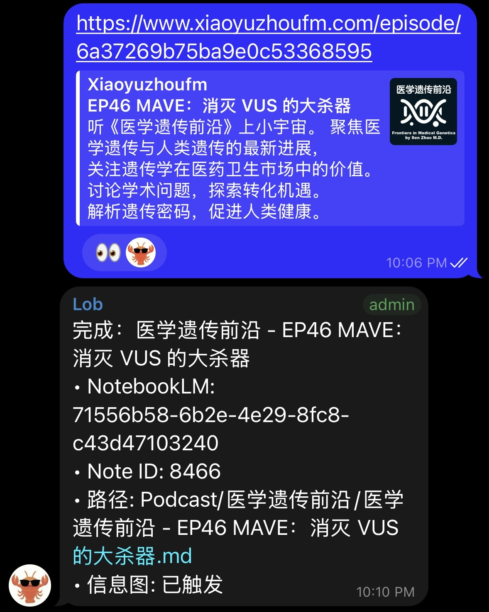
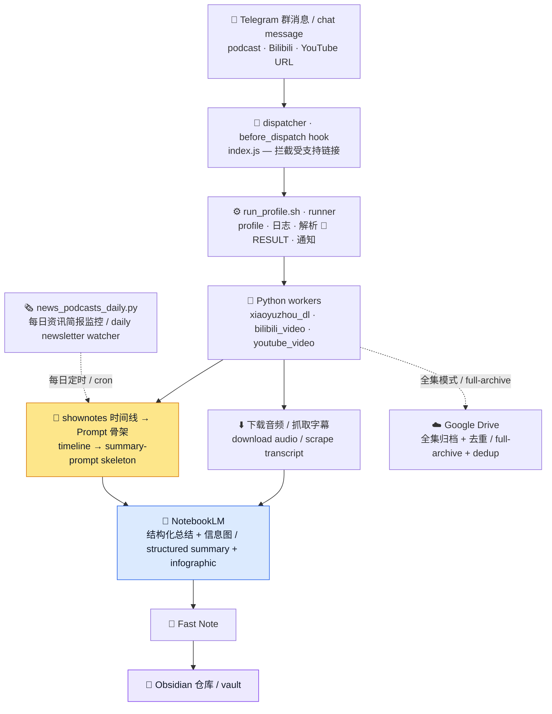

# Podcast2Obsidian

> 把播客、Bilibili / YouTube 视频和每日资讯简报，自动变成经 NotebookLM 总结、
> 排版精良的 Markdown 笔记，直接落进你的 Obsidian 仓库 —— 全程自动，一条聊天消息即可触发。
>
> _Turn podcasts, Bilibili / YouTube videos, and daily newsletters into
> NotebookLM-summarized, richly-formatted Markdown notes in your Obsidian vault —
> fully automatically, triggered by a single chat message._

> 本文档**中文优先**，每节中文在前、English follows。

---

## 这是什么 / What it does

**中文** —— Podcast2Obsidian 是一套**脚本优先（script-first）的归档流水线**。你在聊天群里
发一个受支持的链接，dispatcher 拦截后在后台跑完整流程：下载媒体 → 用 **Google NotebookLM**
总结 → 生成结构保真的 Markdown 笔记（摘要 + shownotes + 字幕全文 + 自动信息图），
经 [Fast Note](https://github.com/haierkeys/obsidian-fast-note-sync) 同步后端写入 Obsidian 仓库。
日常执行路径里没有 agent / 大模型介入，全是确定性的 Python + shell。

**EN** — Podcast2Obsidian is a **script-first archiving pipeline**. You drop a supported
link into a chat group; a dispatcher intercepts it and runs the pipeline in the
background: download the media, summarize it with **Google NotebookLM**, and write a
structure-faithful Markdown note (summary + shownotes + transcript + auto-generated
infographic) into your Obsidian vault via the
[Fast Note](https://github.com/haierkeys/obsidian-fast-note-sync) sync backend. No agent or
LLM sits in the daily execution path — it is deterministic Python + shell.

---

## 实际效果 / In action

**中文** —— 一条链接进，一篇笔记出。下面分别是 **Telegram 端的完整流水**（发送链接 → 🦞 表态接收 →
「完成」回执，含 NotebookLM id、笔记路径、信息图状态）和**每日资讯简报**（多档早报合并成一条摘要推送，
逐条入库后回报「已保存到 Vault」）。

**EN** — One link in, one note out. Left: the **end-to-end Telegram flow** (send a link →
🦞 ack reaction → a "done" receipt with the NotebookLM id, note path, and infographic
status). Right: the **daily newsletter digest** (several morning briefs merged into one
push, filed to the vault, then reported back as saved).

| Telegram 流水 / pipeline flow | 资讯简报 / newsletter digest |
|:---:|:---:|
|  |  |
| 发送 → 接收 → 完成 / send → ack → done | 每日多源摘要 / merged daily brief |

📝 **完整笔记示例 / Full note sample:** [EZ Fashion - 65 Schiaparelli](Examples/EZ-Fashion-65-Schiaparelli/EZ%20Fashion%20-%2065%20Schiaparelli%20神仙打架的高定秀，她在香奈儿隔壁搞超现实主义.md)
—— 一篇真实生成的 Markdown 笔记（frontmatter、顶部信息图、NotebookLM 摘要、时间线结构正文、Shownotes 与配图），
直接在 GitHub 上就能带图查看。
A real generated Markdown note (frontmatter, infographic, NotebookLM summary,
timeline-structured body, shownotes + images) — renders with all images right here on GitHub.

> 📄 笔记是 Markdown 格式；如需 PDF，可在 Obsidian / 编辑器里**手动另存为 PDF**（工具本身暂不直接导出 PDF）。
> 这里附了一份手动导出的样例：[`Grad Lounge 115 ...pdf`](Examples/Grad%20Lounge%20115%20-%20海外学术著作的中译本是怎么出版的.pdf)。
> Notes are Markdown; a PDF can be **saved manually** from Obsidian / your editor (the tool
> doesn't export PDF itself yet). A manually-exported sample is attached for reference.

---

## ⭐ 时间线驱动的总结：把 shownotes 时间轴当作 Prompt 骨架 / Timeline-driven summarization

> 这是 Podcast2Obsidian 总结质量的核心，也是本项目最关键的一处 **Prompt Engineering**。

**中文**

大多数播客的 shownotes 里都带**时间戳章节**（如 `02:15 聊聊行业现状`、`18:40 嘉宾观点`）。
我们不把这些时间轴当成可有可无的元数据，而是把它**变成给 NotebookLM 的总结指令骨架**：

1. **解析时间线层级**（`extract_timeline_outline`）—— 从 shownotes / description 中按层级
   结构脚本化提取：时间戳主标题 → 二级标题；其下的子条目 → 三级 / 四级标题，并智能识别
   「主时间线段落」，避免把无关 bullet 误当章节。
2. **把提纲注入 Prompt**（`build_timeline_summary_prompt`）—— 生成的总结 prompt 不是泛泛的
   「帮我总结这期播客」，而是把这一期**自己的时间线层级**作为输出骨架交给 NotebookLM：
   - `## 章节`、`### 小节`、`#### 要点` 严格按原顺序输出；
   - 去掉时间戳；
   - **根据音频内容充实每个标题**，而不是照抄提纲；
   - 禁止「以下是总结 / 编者按 / 导言」之类套话，直接从第一个标题开始。
3. **无时间线时优雅回退** —— 若该期确实没有可用时间轴，回退到一个通用的「结构化、按原顺序、
   必要时用三级标题」的 prompt，仍然约束 NotebookLM 输出干净的层级结构。

**效果**：每期总结都严格贴合这期节目的**真实结构与节奏**，而不是一段笼统的概述；同一档节目的
不同单集之间，笔记结构也保持一致、可检索、可在 Obsidian 里互链。

**EN**

Most podcast shownotes contain **timestamped chapters** (e.g. `02:15 industry status`,
`18:40 guest's take`). Instead of treating that timeline as throwaway metadata, we turn
it into the **instruction skeleton for the NotebookLM summary**:

1. **Parse the timeline hierarchy** (`extract_timeline_outline`) — scrape shownotes /
   description into a hierarchy: timestamped chapter titles → H2; nested items → H3/H4,
   detecting the "primary timeline run" so stray bullets aren't mistaken for chapters.
2. **Inject the outline into the prompt** (`build_timeline_summary_prompt`) — the summary
   prompt is not a generic "summarize this podcast"; it hands NotebookLM the episode's own
   timeline as the output skeleton: emit `## chapter` / `### section` / `#### point` in the
   original order, drop timestamps, **flesh out each heading from the audio** rather than
   copying the outline, and skip all filler preambles.
3. **Graceful fallback** — when an episode has no usable timeline, it falls back to a
   generic "structured, in-order, H3 when needed" prompt that still constrains NotebookLM
   to clean hierarchical output.

**Result**: every summary tracks the episode's **real structure and pacing** instead of
being a vague blob, and notes for the same show stay consistent, searchable, and
cross-linkable inside Obsidian.

> 💡 **经验法则**：原播客 Show Notes 里的 Timeline 写得越详细，总结的质量就越好。
> **Rule of thumb:** the more detailed the timeline in the original podcast's show notes,
> the better the summary.

---

## 核心特性 / Key features

**中文**

- **多源采集** —— 小宇宙、Apple Podcasts 单集、Pocket Casts、RedCircle 音频直链、
  Goodpods（仅限已配置 resolver）、Bilibili、YouTube。
- **NotebookLM 总结** —— 把音频（或字幕文本）作为 NotebookLM source 上传，自动触发
  [时间线驱动的总结](#-时间线驱动的总结把-shownotes-时间轴当作-prompt-骨架--timeline-driven-summarization)，把回答落地为笔记正文。
- **结构保真笔记** —— 保存的 Markdown 保留原始 shownotes（链接、图片、列表、引用、粗体），
  并追加 clean 后的摘要、`## Shownotes`、clean 后正文、`## 补充 Shownotes` 尾部；
  自动移除 `[1]`、`[2, 3]` 这类引用标记，但保留 Markdown 结构。
- **全图抓取** —— 自动抓取并嵌入单集的**所有图片**：单集播客封面 + Show Notes 里的每一张配图，
  原样下载、存入附件库、按原位置嵌进笔记（参见 [EZ Fashion 示例](#实际效果--in-action) 里的十余张配图）。
- **YAML frontmatter（带回链）** —— 每篇笔记都带 YAML 头：`tags`、`podcast`、`episode`、
  `Release Date`，以及一个**链接回原单集**的 `title` 字段，方便在 Obsidian 里检索、筛选、按属性建表，并一键跳回原节目。
- **自动信息图** —— 每期触发一张 NotebookLM 信息图，下载 PNG，存入 Fast Note 附件库，
  并嵌入到笔记顶部。
- **视频归档** —— Bilibili/YouTube：优先取原语言字幕 → NotebookLM 文本 source → 总结；
  无可用字幕时回落到音频路径。输出与播客笔记对齐（frontmatter、封面、iframe、简介、
  总结、字幕全文）。
- **资讯简报监控** —— 每日批处理，扫描配置好的「早报 / 简报」类播客，处理新单集，归档到
  `Newsletters/<台名>/`，并向 Telegram 推送一行摘要。**订阅源是配置项，不再硬编码**（见下文）。
- **Google Drive 音频归档** —— 全集模式下通过 `gog` CLI 把音频**直接上传到你的 Google Drive**
  （`Podcasts/<节目名>/...`），本地只用临时文件，完成即清理。
- **多设备同步** —— 笔记经 [Fast Note Sync](https://github.com/haierkeys/obsidian-fast-note-sync)
  写入，自动在你的多台设备间同步（这也是我们选用 Fast Note Sync 的原因之一）。
- **幂等去重** —— 按 `episode_id` / 归一化 `episode_url` 做 skip-if-exists；可扫描并清理
  Google Drive 上的历史重复（移入垃圾桶，绝不硬删除）。
- **NotebookLM 队列修剪** —— 把每个 NotebookLM profile 当作滚动队列，达到阈值时先删最旧的
  notebook 再创建新的。
- **强韧性** —— 对截断/空的 NotebookLM 回答自动重试，失败时刷新认证，能从 Drive 回拉就不
  从源站重复下载。

**EN**

- **Multi-source ingestion** — Xiaoyuzhou (小宇宙), Apple Podcasts single episodes,
  Pocket Casts, RedCircle audio links, Goodpods (only via configured resolvers),
  Bilibili, and YouTube.
- **NotebookLM summarization** — uploads audio (or transcript text) as a NotebookLM
  source and auto-runs the [timeline-driven summary](#-时间线驱动的总结把-shownotes-时间轴当作-prompt-骨架--timeline-driven-summarization).
- **Structure-faithful notes** — preserves original shownotes (links, images, lists,
  quotes, bold), appends a cleaned summary, a `## Shownotes` block, the cleaned body, and a
  `## 补充 Shownotes` tail; citation markers like `[1]`, `[2, 3]` are stripped while
  Markdown structure is kept.
- **Full image capture** — automatically grabs and embeds **every image** in an episode:
  the episode's cover art plus all in-shownotes images, downloaded, stored as attachments,
  and kept in place (see the dozen-plus images in the [EZ Fashion sample](#实际效果--in-action)).
- **YAML frontmatter (with back-link)** — every note carries a YAML header (`tags`,
  `podcast`, `episode`, `Release Date`) plus a `title` field that **links back to the source
  episode**, so notes are filterable/queryable in Obsidian and one click from the original.
- **Auto infographic** — one NotebookLM infographic per episode, downloaded, stored as a
  Fast Note attachment, and embedded at the top of the note.
- **Video archiving** — Bilibili/YouTube prefer the original-language transcript →
  NotebookLM text source → summary; fall back to audio when no usable subtitle exists.
- **Newsletter watcher** — a daily batch over configured "morning brief" podcasts, filed
  under `Newsletters/<name>/` with a one-line Telegram digest. Sources are **configured,
  not hardcoded**.
- **Google Drive audio archive** — in full-archive mode, audio is uploaded **straight to
  your Google Drive** via the `gog` CLI (`Podcasts/<show>/...`); local files are temporary
  and cleaned up afterwards.
- **Multi-device sync** — notes are written through
  [Fast Note Sync](https://github.com/haierkeys/obsidian-fast-note-sync) and sync across all
  your devices automatically (one of the reasons we build on Fast Note Sync).
- **Idempotent & deduplicated** — skip-if-exists by `episode_id` / normalized
  `episode_url`; scan and clean historical Drive duplicates (trash, never hard-delete).
- **NotebookLM queue pruning** — each profile is a rolling queue; the oldest notebook is
  deleted before a new one is created once a threshold is reached.
- **Resilient** — retries truncated/empty answers, refreshes auth on failure, re-pulls
  from Drive instead of re-downloading.

---

## 架构 / Architecture



**中文** —— 三层：**dispatcher** 插件拦截聊天链接，**runner**（shell wrapper）负责配置 /
日志 / 通知，**Python worker** 负责真正的下载 → 总结 → 保存。日常运行不启动 agent。

**EN** — Three layers: a **dispatcher** plugin, a **runner** shell wrapper that owns
config/logging/notifications, and **Python workers** that download → summarize → save.
Daily runs never spawn an agent.

---

## 目录结构 / Repository layout

```
.
├── skill/                  # OpenClaw 技能本体：worker 脚本 + SKILL.md
│   ├── SKILL.md            #   运维手册（中英混排）
│   └── scripts/
│       ├── xiaoyuzhou_dl.py        # 播客核心 worker（下载/总结/保存）
│       ├── bilibili_video.py       # Bilibili 归档
│       ├── youtube_video.py        # YouTube 归档
│       ├── news_podcasts_daily.py  # 资讯简报监控（订阅源可 CLI 配置）
│       └── specific_podcasts_daily.py  # 指定节目监控（同样可配置）
├── project/                # 项目级入口：runner + profiles + 文档
│   ├── scripts/
│   │   ├── run_profile.sh           # 标准入口 / wrapper
│   │   ├── send_log.sh
│   │   └── backfill_infographics.py
│   ├── profiles/<profile>/config.env   # 各 profile 设置（群 ID 已清空）
│   ├── newsletter_sources.example.txt  # 简报监控订阅源模板
│   ├── specific_podcasts.example.txt   # 指定节目监控订阅源模板
│   ├── podcast_routing.example.json    # 每节目行为覆盖（模板）
│   └── README.md
└── dispatcher/             # 聊天 dispatcher 插件
    ├── index.js
    └── openclaw.plugin.json
```

> **中文** —— 该结构对应一个 OpenClaw workspace（`skills/` + `projects/` + `extensions/`）。
> 脚本里的路径都通过 `$HOME` / `os.path.expanduser` 解析，因此流水线默认 worker 位于
> `~/.openclaw/workspace/skills/podcast2obsidian/`、runner 位于 `~/.openclaw/workspace/projects/podcast2obsidian/`。
>
> **EN** — The layout mirrors an OpenClaw workspace. Paths resolve via `$HOME` /
> `os.path.expanduser`, so workers live under `~/.openclaw/workspace/skills/podcast2obsidian/` and the
> runner under `~/.openclaw/workspace/projects/podcast2obsidian/`.

---

## 依赖 / Dependencies

| 工具 Tool | 用途 / Purpose |
|------|----------------|
| Python 3 | worker 运行时 / workers |
| `curl` | Telegram 推送与下载 / push & downloads（系统自带） |
| [`nlm`](https://github.com/) CLI (`~/.local/bin/nlm`) | NotebookLM 自动化 / automation |
| `gog` CLI (`~/.local/bin/gog`) | Google Drive 上传与回拉 / upload & pull |
| `bili` CLI (`~/.local/bin/bili`) | B站音频与字幕兜底 / Bilibili audio & subtitle fallback |
| [Fast Note](https://github.com/haierkeys/obsidian-fast-note-sync) | Obsidian 同步后端 / sync backend |

---

## 用法 / Usage

所有运行都通过 wrapper。 / All runs go through the wrapper.

```bash
# 单集播客 → NotebookLM → Obsidian
# Single podcast episode → NotebookLM → Obsidian
bash project/scripts/run_profile.sh --profile xiaoyuzhou \
  --url 'https://www.xiaoyuzhoufm.com/episode/<id>'

# Bilibili 视频（有字幕走文本，无字幕走音频）
# Bilibili video (subtitle → text source; otherwise audio)
bash project/scripts/run_profile.sh --profile bilibili \
  --url 'https://www.bilibili.com/video/BV...'

# YouTube 视频 / YouTube video
bash project/scripts/run_profile.sh --profile youtube \
  --url 'https://www.youtube.com/watch?v=...'

# 仅本地（不写 NotebookLM / Fast Note）——用于测试
# Local-only (no NotebookLM / Fast Note) — for testing
bash project/scripts/run_profile.sh --profile bilibili --url 'BV...' --local

# 预检 / Dry-run
bash project/scripts/run_profile.sh --profile xiaoyuzhou --dry-run

# 扫描 / 清理 Drive 历史重复
# Scan / clean historical duplicates on Google Drive
bash project/scripts/run_profile.sh --profile xiaoyuzhou --scan-drive-duplicates
bash project/scripts/run_profile.sh --profile xiaoyuzhou --dedupe-drive --apply
```

---

## 资讯简报监控 / Newsletter watcher

**中文** —— 每日批处理（`news_podcasts_daily.py`），监控一组「早报 / 简报」类播客，把新单集
归档到 `Newsletters/<台名>/`。订阅源**完全可配置，不再硬编码**。解析优先级：

1. `--source URL`（可重复，优先级最高）
2. `--sources-file PATH`（每行一个链接，`#` 之后为注释）
3. 环境变量 `NEWS_SOURCES_FILE`，否则 `project/newsletter_sources.txt`

**EN** — A daily batch (`news_podcasts_daily.py`) that watches "morning brief" podcasts and
files new episodes under `Newsletters/<name>/`. Sources are **fully configurable**.
Priority: `--source URL` > `--sources-file PATH` / `NEWS_SOURCES_FILE` > default file.

```bash
# 从文件读取订阅源（默认每日模式） / Watch sources from a file (daily mode)
python3 skill/scripts/news_podcasts_daily.py --sources-file project/newsletter_sources.txt

# 临时只看一个源 / Watch one source ad-hoc
python3 skill/scripts/news_podcasts_daily.py \
  --source 'https://www.xiaoyuzhoufm.com/podcast/<your_podcast_id>'

# 补发单集（绕过去重） / Replay one episode (bypasses dedupe)
python3 skill/scripts/news_podcasts_daily.py --only-url '<episode_url>'

# 预览不落库 / Preview without writing
python3 skill/scripts/news_podcasts_daily.py --dry-run
```

起步模板 `project/newsletter_sources.example.txt`，复制为 `newsletter_sources.txt` 后修改：
Starter file — copy to `newsletter_sources.txt` and edit:

```text
# 每行一个小宇宙播客链接；"#" 之后为注释
# one Xiaoyuzhou podcast URL per line; text after "#" is a comment
https://www.xiaoyuzhoufm.com/podcast/<your_podcast_id>   # 资讯早七点 (example / 示例)
```

**中文** —— 同目录还有一个 `specific_podcasts_daily.py`，用法相同（CLI 参数 +
`SPECIFIC_PODCASTS_FILE` / `project/specific_podcasts.txt`，模板
`specific_podcasts.example.txt`），用于那些希望在更长回溯窗口内完整处理、而非只发一行
摘要的节目。

**EN** — A sibling watcher, `specific_podcasts_daily.py`, works the same way for shows you
want fully processed on a longer lookback window rather than filed as a one-line brief.

---

## 输出 / Output

**中文** —— 笔记经 Fast Note 写入 Obsidian。一篇播客笔记包含：链接回源站的一级标题、
NotebookLM 摘要、嵌入的信息图、`## Shownotes`（结构保真的原文）、clean 后正文、
`## 补充 Shownotes`。全集模式下 Drive 音频结构如下：

**EN** — Notes are written to Obsidian through Fast Note. A podcast note contains: a
level-1 title linking back to the source, the NotebookLM summary, the embedded
infographic, `## Shownotes` (structure-faithful original), the cleaned body, and
`## 补充 Shownotes`. Full-archive Drive audio is laid out as:

```text
Podcasts/<节目名 podcast name>/<单集标题 episode title>/
├── <标题 title>.m4a    # 音频 / audio
├── <单集链接 link>.txt # 以链接为文件名 / source link as filename
└── metadata.json       # 元数据 / title, duration, pub date
```

---

## 配置 / Configuration

**中文**

- **Profile** 位于 `project/profiles/<profile>/config.env`（用 `set -a` source）。在其中设置
  `NLM_PROFILE` 把某个 profile 路由到指定 NotebookLM 账号；非必要不要改 `nlm` CLI 的
  `default` profile。
- `config.env` 和 `dispatcher/index.js` 里的 **Telegram 群 ID** 已清空/占位
  （`-100XXXXXXXXXX`）—— 换成你自己的群 ID。
- **NotebookLM 队列阈值** —— `NLM_PRUNE_MAX_COUNT_BY_PROFILE="default:485,secondary:85"`。
- Telegram bot token 在运行时从你的 OpenClaw 配置读取，**不存放在本仓库**。
- **每节目路由**是外部 JSON 文件，不再硬编码。用环境变量 `PODCAST_ROUTING_FILE` 指定
  （默认 `project/podcast_routing.json`）；文件缺失则所有节目走默认行为。复制
  `podcast_routing.example.json` 作为起点。键为节目显示名，支持字段见下方表格。

| 字段 Field | 含义 / Meaning |
|-------|---------|
| `extra_tags` / `primary_tag` | 写入笔记 frontmatter 的标签 / note tags |
| `nlm_profile` | 路由到哪个 NotebookLM profile / which NotebookLM profile |
| `skip_infographic` | 不生成/不嵌入信息图 / no infographic |
| `fast_note_root` | 仓库顶层文件夹（如 `Newsletters`）/ top vault folder |
| `title_date_prefix` / `strip_leading_mmdd` / `keep_issue_in_news_title` / `episode_from_release_date_compact` | 简报标题整形 / newsletter title shaping |
| `direct_markdown` / `skip_notebooklm` / `skip_drive` | 跳过 NotebookLM/Drive，直接存 Markdown / bypass and save Markdown directly |
| `frontmatter_preset` / `note_title_mode` / `preserve_podcast_tag` | 笔记排版 / note formatting |
| `apple_show_url` / `apple_episode_number_regex` / `companion_*` | Apple Podcasts 单集解析 / Apple episode resolution |
| `phrase_patterns` | 用短语定位单集的正则（如 `"我的节目 第12期"`）/ target episodes by typed phrase |

**EN**

- **Profiles** live in `project/profiles/<profile>/config.env` (sourced with `set -a`).
  Set `NLM_PROFILE` there; don't change the `nlm` CLI `default` profile unless intended.
- **Telegram chat ids** in `config.env` and `dispatcher/index.js` are placeholdered
  (`-100XXXXXXXXXX`) — fill in your own.
- **NotebookLM queue thresholds** — `NLM_PRUNE_MAX_COUNT_BY_PROFILE="default:485,secondary:85"`.
- The Telegram bot token is read at runtime from your OpenClaw config — never stored here.
- **Per-podcast routing** is an external JSON file (`PODCAST_ROUTING_FILE`, default
  `project/podcast_routing.json`); a missing file means default behavior for every show.
  Fields are listed in the table above.

---

## 注意事项 / Notes & limitations

**中文**

- Goodpods **不是**泛用支持，只有已配置 resolver 的节目可用。
- 全集模式会先确认，只走 Drive，默认不上传 NotebookLM。
- 大音频上传 NotebookLM 可能需要几分钟。
- 本流水线围绕一套个人 OpenClaw + NotebookLM + Fast Note 环境构建；请把它当作参考实现，
  而非开箱即用的安装器。

**EN**

- Goodpods is **not** generic — only configured resolvers work.
- Full-archive mode prompts for confirmation, goes through Drive only, and does not upload
  to NotebookLM by default.
- Large audio uploads to NotebookLM can take several minutes.
- Built around a personal OpenClaw + NotebookLM + Fast Note setup; treat it as a reference
  implementation rather than a turnkey installer.

---

## ⚠️ 免责声明 / Disclaimer

**中文** —— 本项目以及它产生的一切内容**仅供个人学习与研究使用，请勿用于任何商业用途**。

- 工具下载的音频 / 字幕，以及由 NotebookLM 生成的总结、信息图、导出的 **PDF / Markdown 笔记**，
  均**衍生自第三方版权内容**（播客、视频等），版权归原作者 / 平台所有。
- 这些产物仅供你个人离线学习，**不得**公开分发、二次发布或用于商业目的。
- 请遵守各来源平台的服务条款与原创作者的权利；因使用本工具产生的任何后果由使用者自行承担。
- MIT 许可仅适用于本仓库的**代码**，不授予对上述第三方内容或衍生产物的任何使用 / 商业化权利。

**EN** — This project and everything it produces are **for personal learning and research
only — not for any commercial use**.

- Downloaded audio / transcripts and the NotebookLM-generated summaries, infographics, and
  exported **PDF / Markdown notes** are **derivatives of third-party copyrighted content**
  (podcasts, videos, etc.) owned by the original creators / platforms.
- They are for your personal, offline study only and **must not** be redistributed,
  republished, or used commercially.
- Respect each source platform's Terms of Service and the original creators' rights; you
  alone are responsible for how you use this tool.
- The MIT License covers only the **code** in this repository; it grants no rights over the
  third-party content or the derived outputs above.

---

## 许可 / License

本项目**代码**以 **MIT 许可**发布，详见 [`LICENSE`](LICENSE)（不含上述第三方内容 / 衍生产物）。
The **code** is released under the **MIT License** — see [`LICENSE`](LICENSE)
(this does not cover the third-party content / derived outputs noted above).
